# Dental Clinic Management System
## Description
This is a simple dental clinic management system that allows the user to add, edit, delete, and view patients, dentists, and appointments. The system also allows the user to view the appointments of a specific dentist and patient. The system is implemented using React and NodeJS for the GUI. The system uses a SQLServer database to store the data. The system is implemented using the MVC design pattern.
## Installation


1. Clone the repository
```bash
git clone
```
2. Run the following command to install the dependencies
```bash
cd dental/Docker
```
3. Run the following command to start the server
```bash
docker compose -f app.yml up -d
```
4. Open the following link in your browser
```bash
http://localhost:5173
```
## Images
### Database
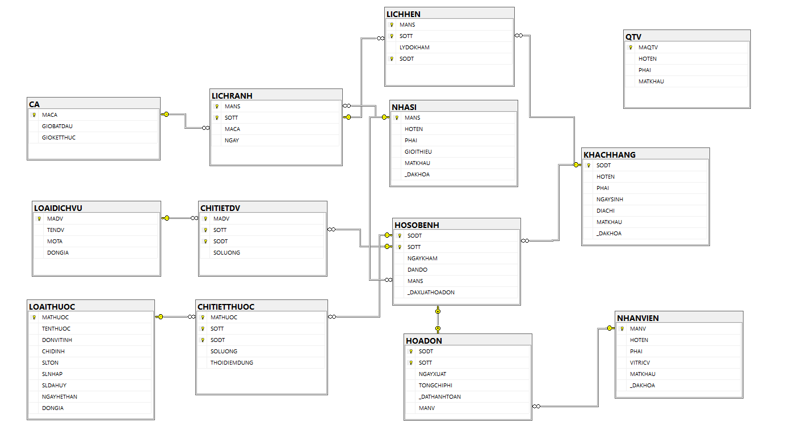
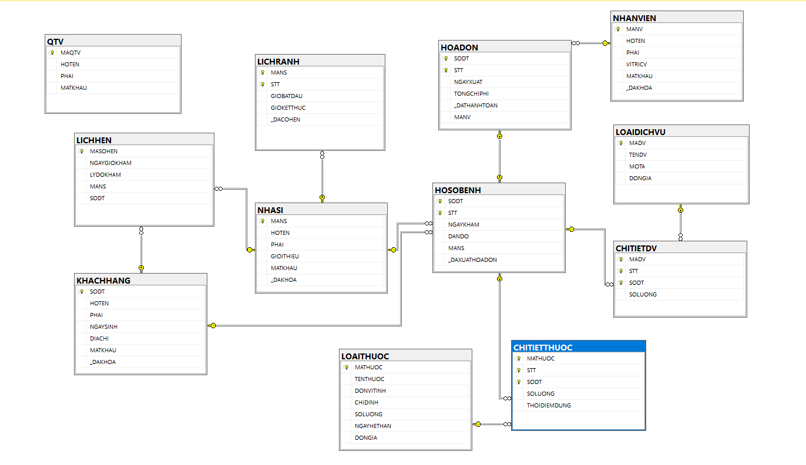


### Home Page

### Guest Page
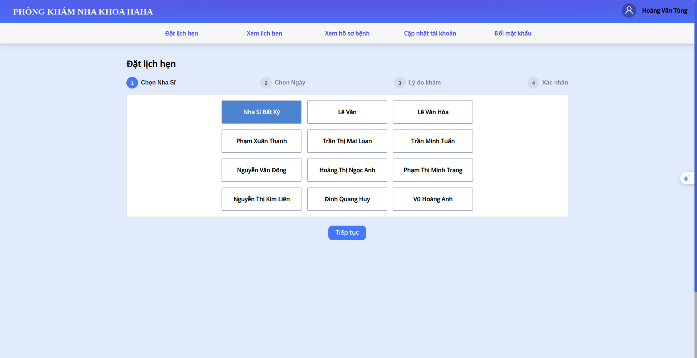
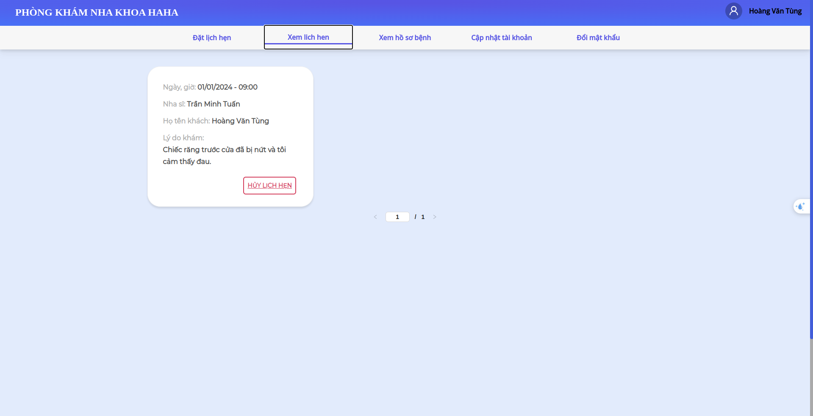
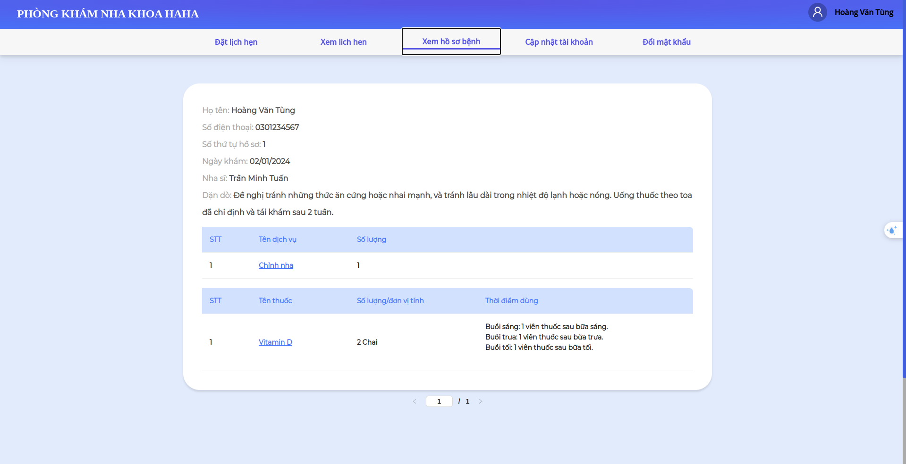
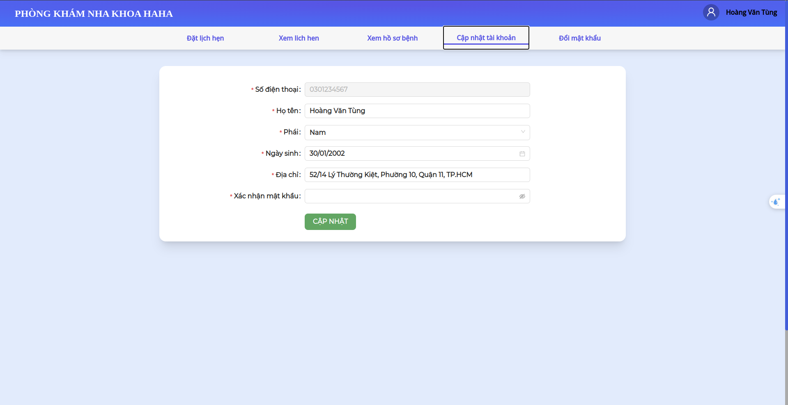
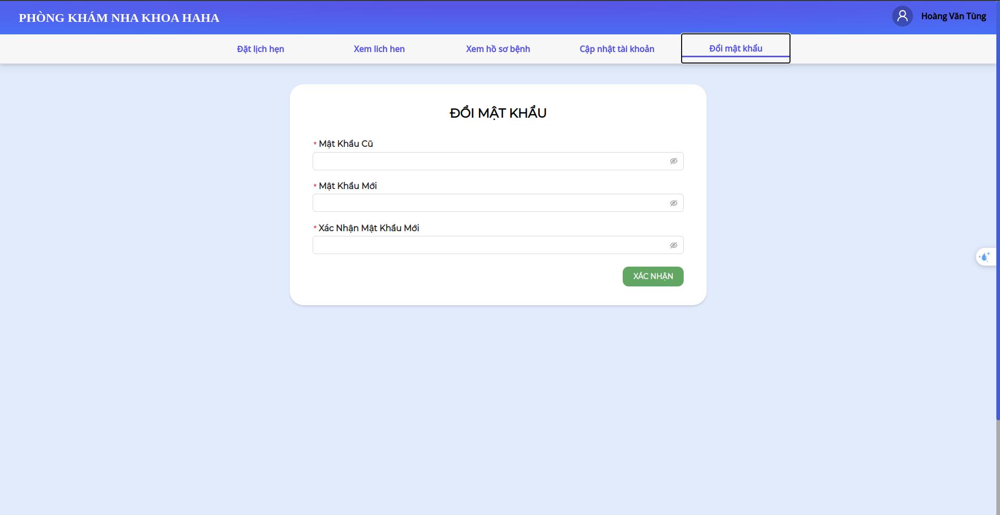

### Admin Page
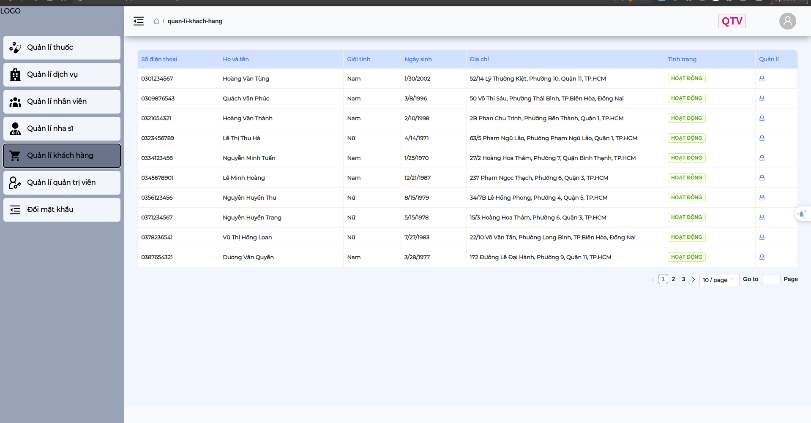

### Dentist Page
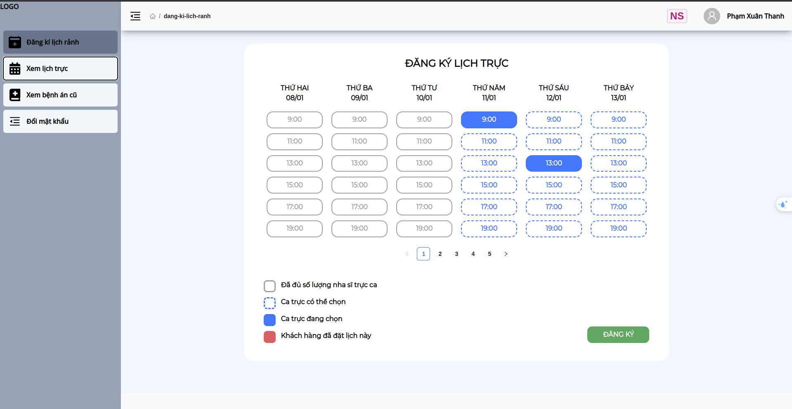
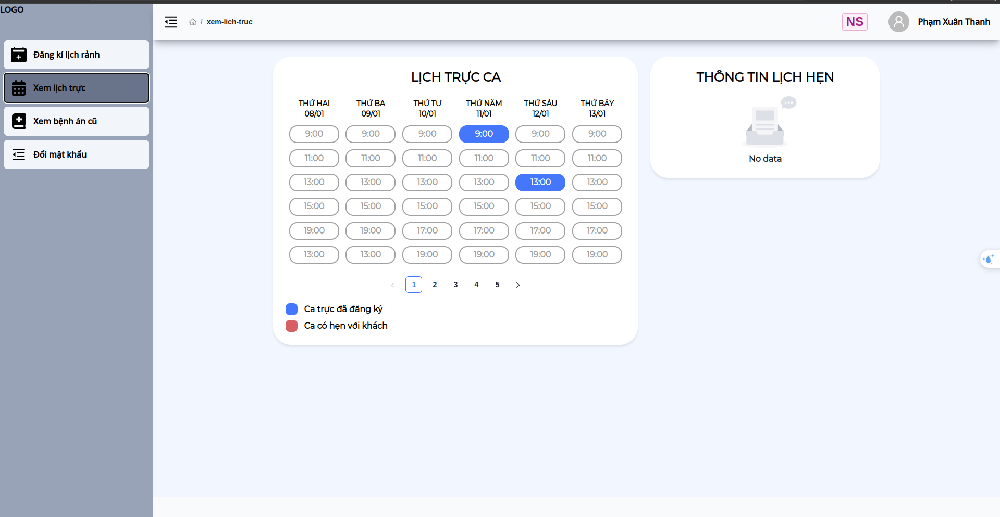

### Staff Page
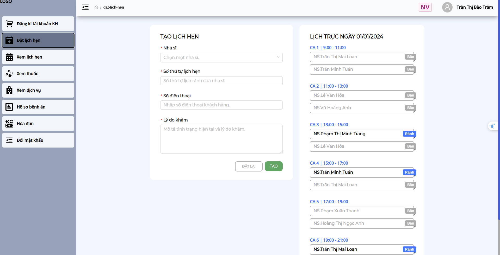


